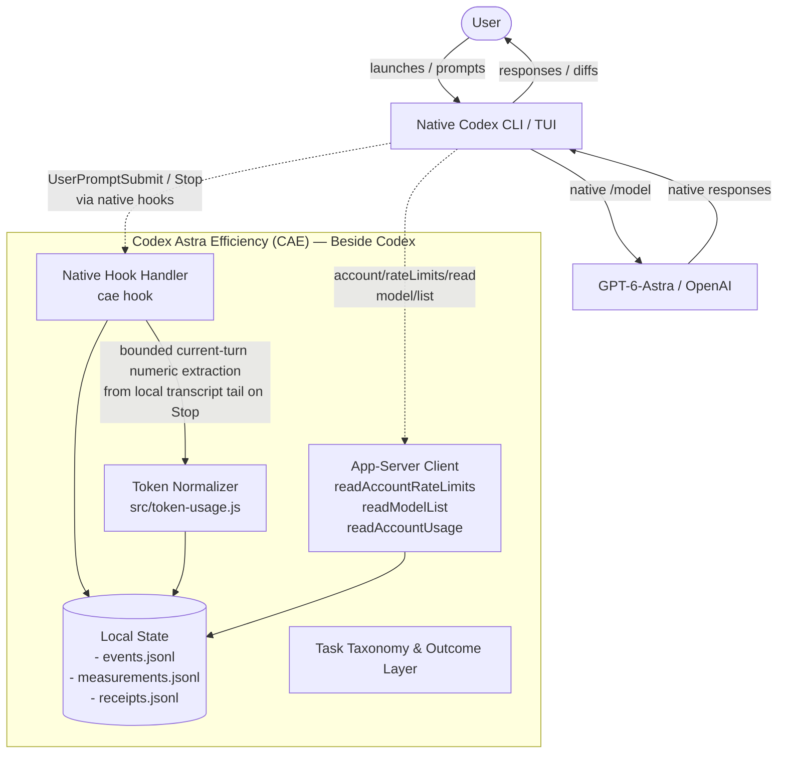

# Codex Astra Efficiency (CAE) Architecture

## Overview & Product Contract

CAE is an out-of-band efficiency, measurement, and passive token-accounting companion for OpenAI Codex when used with GPT-6-Astra.

**Fundamental architectural principle:** CAE lives **beside** Codex, never **between** the user and Astra.

Codex remains the authoritative user control plane. The user:

1. launches Codex normally (`codex`);
2. selects GPT-6-Astra natively via `/model`;
3. interacts directly with Astra for genuine software engineering tasks.

CAE does not proxy prompts, route models, present an alternative UI, or sit in the model-inference path.

---

## 1. Hook Observation Path

Codex supports configurable native lifecycle hooks in its normal configuration. During `cae setup`, CAE registers handlers for:

- `UserPromptSubmit`: emitted when the user submits a prompt before model execution;
- `Stop`: emitted when the turn/session stops.

### Lifecycle and strict non-Astra behavior

When Codex fires a hook:

1. Codex invokes `cae hook` and supplies the hook event as JSON on standard input.
2. CAE loads its local target configuration and checks the event's exact model identifier.
3. If the model is not an explicitly configured Astra identifier, CAE returns `{"continue": true, "suppressOutput": true}` without creating an observation or token measurement.
4. For a targeted Astra event, CAE:
   - keeps prompt/response/source/transcript-path content out of persisted observations;
   - derives deterministic opaque `sessionKey` and `turnKey` values with namespaced SHA-256 hashing of the native identifiers;
   - writes the sanitized observation to `events.jsonl`;
   - returns `{"continue": true, "suppressOutput": true}`.
5. Hook/parser/persistence failures fail open and do not cancel a productive Codex turn.

The non-Astra invariant is about **no CAE observation, transcript scan, token persistence, context injection, routing, or behavior modification**. A hook invocation may still read CAE's small local target configuration before it can determine that the model is non-Astra.

---

## 2. App-Server Quota and Model-Catalog Read Path

Codex includes a JSON-RPC app-server. CAE uses short-lived local app-server processes for zero-inference, read-only operational discovery:

- **Model catalog (`model/list`)**
  - reads the native model-picker catalog;
  - detects Astra candidates without guessing a production slug from marketing names.

- **Account rate limits (`account/rateLimits/read`)**
  - reads the native rate-limit surface through the user's normal Codex authentication;
  - normalizes ChatGPT Plus 5-hour and weekly windows independently;
  - distinguishes shared/default authority from model-specific authority;
  - refuses to calculate deltas across changed/unknown reset or authority boundaries.

- **Account usage (`account/usage/read`)**
  - remains a separate account/billing signal;
  - is never conflated with physical model token counters.

CAE does not scrape browser cookies or duplicate Codex authentication.

---

## 3. Native Token Capture and Accounting Path

Post-v0.1 Phase A adds passive physical-token measurement without manufacturing synthetic Astra tasks.

The first genuine live sample established that ordinary interactive Codex CLI/TUI work reaches CAE through native command hooks rather than by attaching the user's terminal session to CAE's app-server child process. CAE therefore treats two sources differently.

### Primary live passive source: bounded Stop-hook transcript reader

- **Trigger:** targeted Astra `Stop` hook.
- **Source:** `transcript_path` supplied by the native hook, pointing to the active local rollout JSONL.
- **Bound:** at most `TRANSCRIPT_TAIL_SCAN_BYTES` (2 MiB) is read from the transcript tail; CAE does not allocate the whole transcript.
- **Turn binding:** when the native `token_usage_record` carries `thread_id` and `turn_id` (the format observed in the validated Codex runtime), CAE compares those transient values to the current Stop hook's `session_id` and `turn_id` and accepts only the exact matching record.
- **No stale fallback for tagged records:** if the current Stop turn has not yet flushed a matching tagged token record, CAE records no token measurement instead of assigning the previous turn's counters to the current turn.
- **Context association:** `token_count` context-window metadata is considered only inside the selected token record's segment, before the next `token_usage_record`, so a later turn cannot donate context metadata to an earlier turn.
- **Unidentified compatibility state:** one synthetic/legacy token record with no native identity fields can be represented as `unverified_single_record`; multiple unidentified records are never guessed between. Only `matched_turn` attribution is suitable as authoritative current-turn evidence.
- **Content non-persistence:** prompts, assistant text, tool content, diffs, repository paths, transcript paths, and raw native IDs are discarded; only approved numeric counters plus opaque CAE keys are persisted.
- **Fail open:** missing, unreadable, malformed, oversized-outside-bound, or unmatched state produces no authoritative token measurement and does not affect the Codex turn.
- **Duplicate Stop protection:** repeated Stop hooks for the same most-recent CAE session/turn key do not append duplicate measurement rows.

### Programmatic app-server source

- `thread/tokenUsage/updated` is a protocol-supported JSON-RPC notification when Codex is operating through app-server transport.
- CAE keeps parsing/support for this surface because it is useful for programmatic integrations and protocol verification.
- It is not claimed as the passive attachment mechanism for independent interactive CLI/TUI sessions.
- Raw notification `threadId` / `turnId` values are transient correlation inputs only and must not be persisted.

---

## 4. Local Privacy-Safe Storage

CAE's state directory contains separate append-only streams:

| File | Purpose | Privacy invariant |
|---|---|---|
| `config.json` | configured exact Astra target IDs | no prompts/source/auth data |
| `events.jsonl` | sanitized native hook lifecycle observations | opaque keys and presence/status metadata only |
| `measurements.jsonl` | normalized per-turn physical-token measurements | numeric counters, attribution status, opaque keys; no transcript content/raw IDs |
| `receipts.jsonl` | structured run/task evidence | sanitized quota/outcome metadata; no confidential project content by default |

Storage rules:

- POSIX state directories/files are created with restricted modes and token-accounting writers correct broader pre-existing modes where practical (`0700` directories, `0600` files).
- Data is local by default with no automatic upload path.
- Persistence failures fail open.
- `readLastTurnMeasurement` uses a bounded reverse-tail read instead of rereading the complete long-term measurement history for every `--last-turn` query.

---

## 5. Strict Non-Astra No-Op

When a non-Astra model is active, CAE does not:

- create an observation record;
- inspect the Codex transcript;
- create a token measurement;
- inject context;
- route/substitute the model;
- alter permissions or authentication;
- block the turn.

This is the product invariant. It does not require literally zero filesystem reads because the hook may read CAE target configuration before resolving the model match.

---

## 6. Measurement and Outcome Layer

### Physical token metrics

`src/token-usage.js` keeps native model-processing counters separate from Plus allowance movement:

- `input`: native input-token count;
- `cachedInput`: cached subset of input;
- `cacheWriteInput`: cache-write input when reported;
- `output`: model output tokens;
- `reasoningOutput`: reasoning-output subset when reported;
- `total` / `processedVolume`: native physical processing volume;
- `cacheLeverage`: `cachedInput / input` only when cross-field values are internally consistent;
- `reasoningFraction`: `reasoningOutput / output` only when cross-field values are internally consistent;
- `modelContextWindow`: model context capacity, not turn consumption;
- `attributionStatus`: whether a persisted transcript-derived measurement was bound to the exact native Stop turn.

Malformed, unsafe-integer, impossible-ratio, or missing values remain `null` rather than being clamped into plausible-looking metrics.

### Task taxonomy foundation

The current versioned taxonomy is intentionally small:

- `audit_review`
- `bug_diagnosis`
- `focused_fix`
- `multi_fix_implementation`
- `feature_implementation`
- `refactor`
- `documentation_reconciliation`
- `validation_release`
- `large_repository_exploration`

### Outcomes

- `PASS`
- `PARTIAL`
- `FAIL_USEFUL`
- `FAIL_WASTE`

Task/outcome metadata is distinct from physical token counters and Plus allowance movement.

---

## 7. Evidence-Backed Intervention Layer

Later CAE work may test interventions suggested by recurring real-work evidence. No intervention becomes a default merely because it appears token-efficient.

A candidate intervention needs:

1. a documented mechanism;
2. comparable genuine Astra work;
3. pass-through/control evidence;
4. preserved completion/validation quality;
5. clean disable/fallback behavior;
6. strict non-Astra no-op preservation;
7. no unsupported claim that physical token volume is OpenAI's internal Plus quota formula.

Until those conditions are met, CAE remains observability/measurement-first rather than pretending the optimization problem is already solved.
