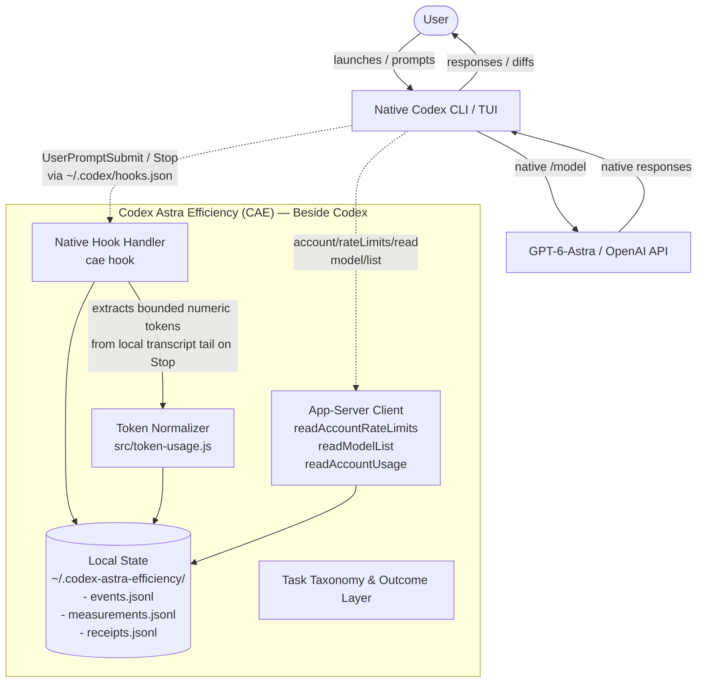

# Codex Astra Efficiency (CAE) Architecture

## Overview & Product Contract

CAE is an out-of-band efficiency, measurement, and passive token-accounting companion for OpenAI Codex when used with GPT-6-Astra.

**Fundamental architectural principle:**
CAE lives **beside** Codex, never **between** the user and Astra.
Codex remains the authoritative user control plane. The user:
1. Launches Codex normally (`codex`).
2. Selects GPT-6-Astra natively via `/model`.
3. Interacts directly with Astra for genuine software engineering tasks.

CAE does not proxy prompts, does not route models, does not present an alternative UI, and never impedes native Codex execution.

---

## 1. Hook Observation Path

Codex supports configurable native lifecycle hooks defined in `~/.codex/hooks.json`. During `cae setup`, CAE registers handlers for two native hook events:
- `UserPromptSubmit`: Emitted when the user submits a prompt before model execution.
- `Stop`: Emitted when the turn or session stops.

### Lifecycle & Strict Non-Astra No-Op:
When Codex fires a hook:
1. Codex invokes `cae hook` and feeds the event payload as JSON via standard input (`stdin`).
2. `cae hook` inspects the `model` identifier.
3. **Strict Non-Astra No-Op:** If the model does not match configured Astra identifiers (`CAE_ASTRA_MODEL_IDS` or `~/.codex-astra-efficiency/config.json`), CAE immediately outputs `{"continue": true, "suppressOutput": true}` and exits with code 0 without writing any disk state.
4. **Targeted Astra Event:** If the model matches an exact Astra target:
   - Sanitizes metadata (strips prompts, responses, file paths, repository roots, account identities, and native thread/turn UUIDs).
   - Generates deterministic opaque HMAC/SHA-256 session and turn keys (`sessionKey`, `turnKey`).
   - Writes the sanitized observation to `~/.codex-astra-efficiency/events.jsonl`.
   - Returns `{"continue": true, "suppressOutput": true}`.
5. **Fail-Open Safety:** Any unhandled exception or parsing failure in `cae hook` is caught, logs an error to `stderr`, outputs `{"continue": true, "suppressOutput": true}`, and exits cleanly with 0. It never blocks or cancels a user turn.

---

## 2. App-Server Quota & Model Catalog Read Path

Codex includes an embedded JSON-RPC app-server (`codex app-server --listen stdio://`). CAE leverages this local interface for zero-inference, read-only operational discovery:

- **Model Catalog Discovery (`model/list`):**
  - Reads the exact native model picker catalog available to the user.
  - Detects visible Astra candidate models without hardcoding or guessing model slugs.
- **Account Rate Limits (`account/rateLimits/read`):**
  - Reads authoritative rate-limit windows directly from Codex's active session.
  - Normalizes ChatGPT Plus 5-hour and weekly quota windows (`usedPercent`, `windowDurationMins`, `resetsAt`).
  - Separates shared default quotas from model-specific quotas.
  - Tracks reset-boundary continuity to accurately attribute quota burn.
- **Account Credit / Usage (`account/usage/read`):**
  - Read-only inspection of account usage buckets and estimated credit micros.
  - Strictly separated from physical token accounting.

---

## 3. Native Token Capture & Accounting Path (Passive Accounting)

In post-v0.1 Phase A, CAE establishes the deterministic foundation for capturing native physical token counters without running synthetic or manufactured Astra inference.

Empirical verification from the first genuine live Astra sample demonstrated that independent interactive Codex sessions execute via standalone CLI/TUI and trigger command hooks rather than running as clients of CAE app-server child process. Accordingly, CAE distinguishes two complementary capture surfaces:

### Primary Live Passive Source: Bounded Stop Hook Transcript Reader
- **Trigger:** Codex fires the native `Stop` hook (`cae hook --cae-owned`) upon turn completion.
- **Source Authority:** The hook payload supplies `transcript_path` pointing to the active session rollout (`~/.codex/sessions/**/rollout-*.jsonl`).
- **Bounded Scanning (`TRANSCRIPT_TAIL_SCAN_BYTES` = 2 MiB):** CAE opens the file read-only and inspects only a bounded tail buffer, scanning backwards for `token_usage_record` (`turn_token_usage`) and `event_msg` (`token_count`).
- **No Full Transcript Allocation:** Whole-file reads are prohibited; the scan is strictly bounded in memory and I/O.
- **Content-Nonpersisting:** Raw prompt text, assistant responses, diffs, tool calls, and transcript paths are discarded immediately. Only normalized numeric counters (`input`, `cachedInput`, `output`, `reasoningOutput`, `total`, `modelContextWindow`) are retained.
- **Fail-Open:** Any stat, open, read, or JSON parse error fails open silently without disrupting or delaying Codex.

### Programmatic App-Server Surface: JSON-RPC Notifications
- **Method:** `thread/tokenUsage/updated` pushed over JSON-RPC stdio transport when Codex is launched via `codex app-server`.
- **Status:** Protocol-supported and verified with unit coverage; maintained as an integration and research path, but not relied upon as the passive attachment mechanism for independent interactive CLI/TUI sessions.
- **Strict Anonymization:** Raw IDs received over JSON-RPC are converted to HMAC/SHA-256 opaque keys and never persisted.

## 4. Local Privacy-Safe Storage

CAE persists all data locally within the user's state directory (`~/.codex-astra-efficiency/`):

| File | Purpose | Privacy Invariant |
|---|---|---|
| `config.json` | Configured Astra target model IDs | Contains only exact validated model slugs |
| `events.jsonl` | Native hook lifecycle observations | Contains opaque keys, presence flags, timestamps; NO raw prompts, NO paths |
| `measurements.jsonl` | Normalized per-turn token measurements | Contains physical token counts, opaque keys, context window; NO prompts, NO code, NO raw IDs |
| `receipts.jsonl` | Structured run and task receipts | Contains sanitized quota deltas, evidence summaries; NO confidential project content |

**Storage Rules:**
- Permissions are restricted (`0o700` directories, `0o600` files).
- Zero automated uploads: data remains local and non-networked.
- Append-only streams fail open: write errors do not propagate to the caller.

---

## 5. Strict Non-Astra No-Op

CAE is explicitly designed to optimize and measure GPT-6-Astra workflows. When a non-Astra model (e.g. `gpt-5.6-sol`, `codex-mini`) is active:
- Hooks execute within sub-millisecond execution time.
- Zero disk I/O is performed.
- Zero telemetry or logs are stored.
- Normal Codex behavior proceeds entirely unmodified.

---

## 6. Measurement & Outcome Layer

Turn and run records capture structured, non-content task metrics:

### Physical Token Metrics (`src/token-usage.js`)
- `input`: Total input prompt tokens.
- `cachedInput`: Cached input tokens read from prefix cache.
- `cacheWriteInput`: Input tokens that wrote new cache entries.
- `output`: Total completion tokens generated.
- `reasoningOutput`: Internal reasoning / chain-of-thought tokens.
- `total` / `processedVolume`: Physical model processing volume.
- `cacheLeverage`: Calculated as `cachedInput / input`.
- `reasoningFraction`: Calculated as `reasoningOutput / output`.

### Task Taxonomy Foundation
A versioned taxonomy categorizes software engineering tasks without reading prompt text:
- `audit_review`
- `bug_diagnosis`
- `focused_fix`
- `multi_fix_implementation`
- `feature_implementation`
- `refactor`
- `documentation_reconciliation`
- `validation_release`
- `large_repository_exploration`

### Outcomes
- `PASS`
- `PARTIAL`
- `FAIL_USEFUL`
- `FAIL_WASTE`

---

## 7. Future Evidence-Backed Intervention Layer

In subsequent phases (post-Phase A), CAE will leverage collected passive token and quota receipts to provide evidence-backed suggestions (e.g. prompt cache alignment, context compacting, reset timing).
All future interventions will:
1. Maintain strict user agency (advisory recommendations, no forced changes).
2. Remain strictly fail-open and out of the critical inference path.
3. Be grounded strictly in deterministic empirical measurements from genuine engineering tasks.
